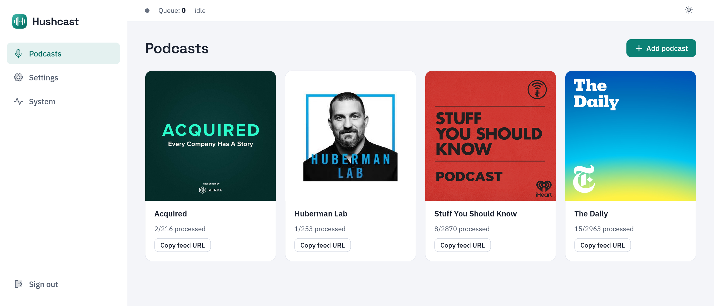

<p align="center">
  
</p>

<h1 align="center">Hushcast</h1>

<p align="center"><b>Your podcasts, without the ads.</b></p>

Hushcast is a self-hosted server that removes ads from your podcasts. Add a podcast, and every new episode is automatically transcribed, scanned for ads and sponsor reads by an LLM, and cut clean. You subscribe your regular podcast app to the feed Hushcast serves and just listen.

<p align="center">
  
</p>

## Highlights

- **Works with any podcast app.** Each podcast gets its own private RSS feed. Subscribe to it like any other show.
- **Bring your own AI.** Works with any OpenAI-compatible transcription and chat endpoint: cloud APIs or fully local models. No data leaves your network unless you choose a cloud provider.
- **Invisible when it matters.** Only fully processed episodes appear in your feed, so your app never sees a half-finished episode, and listening history is preserved.
- **Tunable detection.** Edit the detection prompt, add per-podcast hints, and correct mistakes. Corrections feed back into future detection.

## Getting started

### 1. Pick your AI endpoints

You need two OpenAI-compatible endpoints, entered in **Settings** on first run:

- **Transcription**: anything implementing the OpenAI transcriptions API.
- **LLM**: anything implementing the OpenAI chat-completions API.

<details>
<summary><b>Example: everything at OpenAI</b> (one account, no hardware)</summary>

| Setting | Value |
|---|---|
| Transcription base URL | `https://api.openai.com/v1` |
| Transcription model | `whisper-1` |
| LLM base URL | `https://api.openai.com/v1` |
| LLM model | `gpt-4o-mini` (or better) |

</details>

<details>
<summary><b>Example: cloud mix</b> (Groq for audio, OpenRouter for the LLM)</summary>

| Setting | Value |
|---|---|
| Transcription base URL | `https://api.groq.com/openai/v1` |
| Transcription model | `whisper-large-v3` |
| LLM base URL | `https://openrouter.ai/api/v1` |
| LLM model | any chat model, e.g. `z-ai/glm-5.3-flash` |

</details>

<details>
<summary><b>Example: fully local</b> (no data leaves your network, needs a GPU for reasonable speed)</summary>

| Setting | Value |
|---|---|
| Transcription base URL | `http://<whisper-host>:8000/v1` ([speaches](https://github.com/speaches-ai/speaches) or [whisperx-api-server](https://github.com/Nyralei/whisperx-api-server)) |
| Transcription model | `large-v3` |
| Word timestamps | enable if your provider supports them, sharpens cut boundaries |
| LLM base URL | `http://<ollama-host>:11434/v1` (Ollama, vLLM/llama.cpp work the same way) |
| LLM model | a strong long-context instruct model, e.g. `qwen2.5:32b-instruct` |

</details>

The two endpoints are independent. Mix and match freely. Each takes an API key unless your server is unauthenticated.

### 2. Deploy with Docker

```bash
mkdir hushcast && cd hushcast
curl -O https://raw.githubusercontent.com/msitt/hushcast/master/docker-compose.yml
docker compose up -d
```

Before starting, edit the compose file and set:

- **`HUSHCAST_PUBLIC_URL`**: the external URL the app is reachable at, which gets baked into feed URLs.
- **Volumes**: `/config` holds the database and settings and `/data` holds audio and transcripts.

Serve the app over HTTPS (reverse proxy or tunnel). Feeds are protected by a secret token in the URL.

#### Container user

The user defaults to uid:gid **1000:1000**. To use a different one, set `PUID`/`PGID` in the environment:

```yaml
services:
  hushcast:
    environment:
      - PUID=99
      - PGID=100
```

This only sets ownership on `/config` and `/data` themselves, not recursively, so it stays fast even with a large `/data`. Files created afterward are owned correctly since the app runs as that uid:gid. If you change `PUID`/`PGID` after the first startup, fix existing files yourself: `chown -R <uid>:<gid>` on your host `config`/`data` directories.

### 3. Set up and subscribe

Open the web UI. The first visit creates your login, then:

1. Go to **Settings** and enter your transcription and LLM endpoints.
2. Add a podcast by its RSS feed URL. You can use [Podcast RSS Feed Finder](https://rss.com/tools/find-my-feed/).
3. Copy the podcast's subscribe URL into your podcast app.

New episodes process automatically. Existing back-catalog episodes aren't processed by default. Queue any you want from the UI.

---

## Details

### Authentication

The web UI and API require a login (created on first visit, changeable under **Settings → Authentication**). If a reverse proxy already authenticates the UI, disable the built-in login with `HUSHCAST_AUTH=disabled`.

### Reverse proxy

Podcast clients can't log in, so if your proxy adds its own auth layer, these routes must be reachable **without** it:

- **`/p/*`**: the served feeds and episode audio. They're self-protected by the secret token in the path (shown in Settings, regenerable). Pass `Range` request headers through untouched. Clients use them to stream and seek.
- **`/healthz`** (optional): only if you point external uptime monitoring at it.

Everything else (the UI, `/assets/*`, `/api/*`) should stay protected.

### Environment variables

| Variable | Default | Purpose |
|---|---|---|
| `HUSHCAST_PUBLIC_URL` | `http://localhost:4874` | External base URL, baked into feed/enclosure URLs |
| `HUSHCAST_CONFIG_DIR` | `./config` (`/config` in Docker) | SQLite DB + settings |
| `HUSHCAST_DATA_DIR` | `./data` (`/data` in Docker) | Audio, transcripts, scratch |
| `HUSHCAST_PORT` | `4874` | Listen port inside the container (Docker only) |
| `HUSHCAST_AUTH` | `enabled` | Set to `disabled` only when a reverse proxy already protects the app |
| `HUSHCAST_LOG_LEVEL` | unset | Debug override. Normally change the log level from the UI instead |

Everything else is runtime settings, edited in the web UI and stored in the database.

### Development

Requirements: [uv](https://docs.astral.sh/uv/), Node 24 (`.node-version`, fnm-compatible), ffmpeg on PATH.

```bash
uv sync                       # install backend deps
uv run pytest                 # unit tests
uv run uvicorn hushcast.main:app --reload --port 4874   # backend

cd frontend
npm install
npm run dev                   # Vite dev server, proxies /api and /p to :4874
```

Config comes from `HUSHCAST_*` env vars or a `.env` file (see `.env.example`).

The database migrates itself to head on startup. After changing `models.py`, generate a migration against an up-to-date dev database and commit it with the model change:

```bash
uv run alembic revision --autogenerate -m "describe the change"
uv run alembic upgrade head        # or just restart the app
```

## License

[AGPL-3.0](LICENSE)
